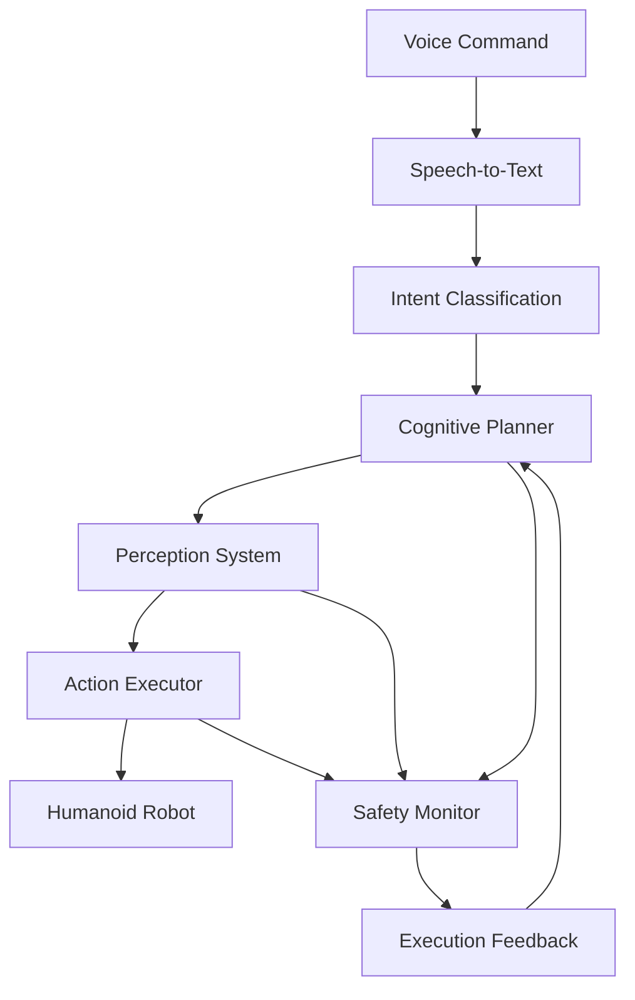

# Chapter 3: Capstone – The Autonomous Humanoid

## Learning Objectives

By the end of this chapter, students will be able to:
- Integrate all VLA components into a complete autonomous humanoid system
- Implement end-to-end pipelines from voice input to physical manipulation
- Use computer vision for object identification in simulated environments
- Execute complex tasks in simulated humanoid environments
- Design and implement safety mechanisms for autonomous operation

## Introduction

The capstone chapter brings together all the components of Vision-Language-Action (VLA) systems into a complete autonomous humanoid robot. This integration demonstrates how voice interfaces, cognitive planning, and physical action execution work together to create an intelligent, responsive robotic system capable of understanding and executing complex tasks in natural environments.

This chapter represents the culmination of the VLA module, where students will implement a complete pipeline that processes voice commands, plans complex tasks, and executes them in simulated humanoid environments. The focus is on system integration, safety considerations, and practical implementation of all concepts covered in the previous chapters.

## End-to-End Pipeline Integration

### Architecture Overview

The end-to-end autonomous humanoid system integrates multiple subsystems:

1. **Voice Input System**: Processes natural language commands using OpenAI Whisper
2. **Intent Classification**: Converts speech to structured robot intents
3. **Cognitive Planning**: Uses LLMs for task decomposition and action sequencing
4. **Perception System**: Identifies objects and understands the environment
5. **Action Execution**: Controls the humanoid robot's movements and manipulations
6. **Safety Monitor**: Ensures safe operation throughout the pipeline

### System Architecture Diagram



### Main Integration Pipeline

```python
import asyncio
import rclpy
from rclpy.node import Node
from speech_msgs.msg import Transcription
from robot_actions.action import ExecuteCommand
from vision_msgs.msg import DetectionArray
from std_msgs.msg import String
import openai
import whisper

class AutonomousHumanoidNode(Node):
    def __init__(self):
        super().__init__('autonomous_humanoid_node')

        # Initialize subsystems
        self.speech_to_text = SpeechToTextNode()
        self.intent_classifier = IntentClassifier()
        self.cognitive_planner = CognitivePlanner()
        self.perception_system = PerceptionSystem(self)
        self.action_executor = ActionExecutor(self)
        self.safety_monitor = SafetyMonitor(self)

        # Publishers and subscribers
        self.voice_sub = self.create_subscription(
            String, '/robot/voice_input', self.voice_callback, 10
        )
        self.status_pub = self.create_publisher(
            String, '/robot/status', 10
        )

        self.pipeline_active = False

    async def voice_callback(self, msg):
        if self.pipeline_active:
            self.get_logger().warn("Pipeline busy, ignoring new command")
            return

        self.pipeline_active = True
        self.status_pub.publish(String(data="processing_command"))

        try:
            # Step 1: Process voice command
            transcription = await self.process_voice_command(msg.data)

            # Step 2: Classify intent
            intent = await self.classify_intent(transcription)

            # Step 3: Plan actions
            action_sequence = await self.plan_actions(intent)

            # Step 4: Validate safety
            if not await self.validate_safety(action_sequence):
                self.get_logger().error("Safety validation failed")
                return

            # Step 5: Execute actions
            success = await self.execute_actions(action_sequence)

            if success:
                self.get_logger().info("Command executed successfully")
                self.status_pub.publish(String(data="command_completed"))
            else:
                self.get_logger().error("Command execution failed")
                self.status_pub.publish(String(data="command_failed"))

        except Exception as e:
            self.get_logger().error(f"Pipeline error: {str(e)}")
            self.status_pub.publish(String(data="error_occurred"))
        finally:
            self.pipeline_active = False

    async def process_voice_command(self, audio_data):
        # Process audio using Whisper
        return self.speech_to_text.transcribe(audio_data)

    async def classify_intent(self, transcription):
        # Classify intent using LLM
        return self.intent_classifier.classify_intent(transcription)

    async def plan_actions(self, intent):
        # Plan actions using cognitive planner
        return self.cognitive_planner.plan_for_intent(intent)

    async def validate_safety(self, action_sequence):
        # Validate safety using safety monitor
        return self.safety_monitor.validate_plan(action_sequence)

    async def execute_actions(self, action_sequence):
        # Execute actions using action executor
        return await self.action_executor.execute_sequence(action_sequence)
```

### Pipeline Configuration and Parameters

The system should be configurable for different environments and robot capabilities:

```python
PIPELINE_CONFIG = {
    "voice_processing": {
        "model": "whisper-base",
        "language": "en",
        "confidence_threshold": 0.8,
        "timeout": 5.0  # seconds
    },
    "intent_classification": {
        "model": "gpt-4-turbo",
        "confidence_threshold": 0.7,
        "max_retries": 3
    },
    "planning": {
        "max_plan_length": 50,  # max actions in sequence
        "planning_timeout": 30.0,  # seconds
        "replanning_threshold": 0.3  # confidence threshold for replanning
    },
    "safety": {
        "collision_threshold": 0.3,  # meters
        "payload_limit": 5.0,  # kg
        "max_velocity": 1.0  # m/s
    },
    "execution": {
        "max_execution_time": 300.0,  # seconds
        "action_timeout": 60.0,  # seconds per action
        "feedback_frequency": 1.0  # Hz
    }
}
```

### Error Handling and Recovery

The integrated system must handle errors gracefully and attempt recovery:

```python
class PipelineErrorRecovery:
    def __init__(self, main_node):
        self.main_node = main_node
        self.error_history = []
        self.max_recovery_attempts = 3

    async def handle_error(self, error_type, error_context):
        self.error_history.append({
            "type": error_type,
            "context": error_context,
            "timestamp": self.main_node.get_clock().now()
        })

        # Attempt different recovery strategies based on error type
        if error_type == "speech_recognition_error":
            return await self.recovery_speech_recognition(error_context)
        elif error_type == "intent_classification_error":
            return await self.recovery_intent_classification(error_context)
        elif error_type == "planning_error":
            return await self.recovery_planning(error_context)
        elif error_type == "execution_error":
            return await self.recovery_execution(error_context)
        else:
            return await self.generic_recovery(error_context)

    async def recovery_speech_recognition(self, context):
        # Try alternative speech recognition methods
        # Ask user to repeat command
        self.main_node.ask_user_to_repeat()
        return True

    async def recovery_intent_classification(self, context):
        # Ask for clarification
        clarification = self.main_node.request_clarification(context["transcription"])
        if clarification:
            # Retry with clarification
            return True
        return False

    async def recovery_planning(self, context):
        # Simplify the goal or break it into smaller tasks
        simplified_plan = self.main_node.simplify_plan(context["goal"])
        return simplified_plan is not None

    async def recovery_execution(self, context):
        # Retry with modified parameters or alternative approach
        alternative_action = self.main_node.find_alternative_action(context["failed_action"])
        return alternative_action is not None

    async def generic_recovery(self, context):
        # Return to safe state and report error
        await self.main_node.return_to_safe_state()
        return False
```

## Object Identification Using Computer Vision

### Vision System Architecture

The computer vision system is responsible for identifying and localizing objects in the environment:

```python
import cv2
import numpy as np
import torch
from torchvision import transforms
from sensor_msgs.msg import Image
from vision_msgs.msg import Detection2DArray, Detection2D
from builtin_interfaces.msg import Time
from cv_bridge import CvBridge

class VisionSystem:
    def __init__(self, node):
        self.node = node
        self.bridge = CvBridge()

        # Load pre-trained object detection model (e.g., YOLOv8, Detectron2)
        self.detection_model = torch.hub.load('ultralytics/yolov5', 'yolov5s', pretrained=True)

        # Subscribe to camera feed
        self.image_sub = self.node.create_subscription(
            Image, '/camera/rgb/image_raw', self.image_callback, 10
        )

        # Publish detections
        self.detection_pub = self.node.create_publisher(
            Detection2DArray, '/robot/detections', 10
        )

        self.latest_detections = None

    def image_callback(self, msg):
        # Convert ROS Image to OpenCV
        cv_image = self.bridge.imgmsg_to_cv2(msg, desired_encoding='bgr8')

        # Run object detection
        results = self.detection_model(cv_image)

        # Convert results to Detection2DArray
        detection_array = self.convert_to_detection_array(results, msg.header.stamp)

        # Publish detections
        self.detection_pub.publish(detection_array)

        # Store for later use
        self.latest_detections = detection_array

    def convert_to_detection_array(self, results, timestamp):
        detection_array = Detection2DArray()
        detection_array.header.stamp = timestamp
        detection_array.header.frame_id = "camera_frame"

        # Extract detections from model results
        for detection in results.xyxy[0]:  # x1, y1, x2, y2, confidence, class
            x1, y1, x2, y2, conf, cls = detection

            if conf > 0.5:  # confidence threshold
                detection_msg = Detection2D()
                detection_msg.header.stamp = timestamp
                detection_msg.header.frame_id = "camera_frame"

                # Set bounding box
                bbox = detection_msg.bbox
                bbox.center.x = float((x1 + x2) / 2)
                bbox.center.y = float((y1 + y2) / 2)
                bbox.size_x = float(x2 - x1)
                bbox.size_y = float(y2 - y1)

                # Set ID and confidence
                detection_msg.results = [ObjectHypothesisWithPose()]
                detection_msg.results[0].id = str(int(cls))
                detection_msg.results[0].score = float(conf)

                detection_array.detections.append(detection_msg)

        return detection_array

    def get_object_by_name(self, object_name):
        """Find an object by name in the latest detections"""
        if not self.latest_detections:
            return None

        for detection in self.latest_detections.detections:
            class_name = self.detection_model.names[int(detection.results[0].id)]
            if object_name.lower() in class_name.lower():
                return detection

        return None
```

### 3D Object Localization

For humanoid robots, 3D localization is crucial for manipulation tasks:

```python
from sensor_msgs.msg import PointCloud2
import sensor_msgs.point_cloud2 as pc2
from geometry_msgs.msg import PointStamped, TransformStamped

class ObjectLocalization3D:
    def __init__(self, node):
        self.node = node
        self.bridge = CvBridge()

        # Subscribe to RGB and depth images
        self.rgb_sub = self.node.create_subscription(
            Image, '/camera/rgb/image_raw', self.rgb_callback, 10
        )
        self.depth_sub = self.node.create_subscription(
            Image, '/camera/depth/image_raw', self.depth_callback, 10
        )

        # Subscribe to camera info for intrinsics
        self.camera_info_sub = self.node.create_subscription(
            CameraInfo, '/camera/rgb/camera_info', self.camera_info_callback, 10
        )

        self.camera_intrinsics = None
        self.latest_depth = None

    def rgb_callback(self, rgb_msg):
        # Process RGB image for object detection
        cv_rgb = self.bridge.imgmsg_to_cv2(rgb_msg, desired_encoding='bgr8')

        # Run object detection
        results = self.vision_system.detection_model(cv_rgb)

        # For each detected object, find 3D position using depth
        for detection in results.xyxy[0]:
            x1, y1, x2, y2, conf, cls = detection
            if conf > 0.5:
                # Calculate center of bounding box in image coordinates
                center_x = int((x1 + x2) / 2)
                center_y = int((y1 + y2) / 2)

                # Get depth at center point
                if self.latest_depth is not None:
                    depth_value = self.latest_depth[center_y, center_x]

                    # Convert pixel coordinates to 3D world coordinates
                    world_point = self.pixel_to_world(
                        center_x, center_y, depth_value, self.camera_intrinsics
                    )

                    # Publish 3D object location
                    self.publish_object_location(cls, world_point, rgb_msg.header)

    def pixel_to_world(self, u, v, depth, intrinsics):
        """Convert pixel coordinates + depth to world coordinates"""
        # Camera intrinsics: [fx, fy, cx, cy]
        fx, fy, cx, cy = intrinsics

        # Convert to normalized coordinates
        x_norm = (u - cx) / fx
        y_norm = (v - cy) / fy

        # Convert to world coordinates
        world_x = x_norm * depth
        world_y = y_norm * depth
        world_z = depth

        return [world_x, world_y, world_z]

    def publish_object_location(self, class_id, world_point, header):
        """Publish object location in world coordinates"""
        point_stamped = PointStamped()
        point_stamped.header = header
        point_stamped.point.x = world_point[0]
        point_stamped.point.y = world_point[1]
        point_stamped.point.z = world_point[2]

        # Publish using appropriate topic
        # This would typically be stored in a knowledge base or TF tree
```

### Object Recognition and Semantic Understanding

The system should not only detect objects but also understand their semantic properties:

```python
class SemanticObjectRecognition:
    def __init__(self):
        # Load semantic segmentation model
        self.segmentation_model = torch.hub.load(
            'pytorch/vision:v0.10.0',
            'deeplabv3_resnet50',
            pretrained=True
        )
        self.segmentation_model.eval()

        # Object property database
        self.object_properties = {
            "cup": {"graspable": True, "pourable": True, "size": "small", "material": "ceramic/plastic"},
            "book": {"graspable": True, "stackable": True, "size": "medium", "material": "paper"},
            "chair": {"graspable": False, "sit_on": True, "size": "large", "material": "wood/metal"},
            # ... more objects
        }

    def analyze_object_properties(self, detection, image):
        """Analyze properties of detected object"""
        # Extract bounding box region
        x1, y1, x2, y2 = detection.bbox.center.x - detection.bbox.size_x/2, \
                         detection.bbox.center.y - detection.bbox.size_y/2, \
                         detection.bbox.center.x + detection.bbox.size_x/2, \
                         detection.bbox.center.y + detection.bbox.size_y/2

        # Crop image to object region
        object_region = image[int(y1):int(y2), int(x1):int(x2)]

        # Perform semantic segmentation on object region
        with torch.no_grad():
            input_tensor = transforms.ToTensor()(object_region).unsqueeze(0)
            output = self.segmentation_model(input_tensor)['out'][0]
            normalized_masks = output.softmax(0)

        # Analyze object properties based on segmentation and class
        class_name = detection.results[0].id  # This would need to be mapped to actual class name
        properties = self.object_properties.get(class_name, {})

        # Add additional properties from segmentation
        properties['color'] = self.extract_color(object_region)
        properties['texture'] = self.extract_texture(object_region)

        return properties

    def extract_color(self, image_region):
        """Extract dominant color from image region"""
        # Convert to HSV for better color analysis
        hsv = cv2.cvtColor(image_region, cv2.COLOR_BGR2HSV)

        # Find dominant color using clustering or histogram analysis
        # Simplified approach: just return average color
        avg_color = np.mean(image_region, axis=(0, 1))
        return [int(c) for c in avg_color]

    def extract_texture(self, image_region):
        """Extract texture features from image region"""
        # Use techniques like Local Binary Patterns (LBP) or Gray-Level Co-occurrence Matrix (GLCM)
        gray = cv2.cvtColor(image_region, cv2.COLOR_BGR2GRAY)

        # Simple approach: use variance as texture measure
        texture_variance = np.var(gray)

        # Classify texture based on variance
        if texture_variance < 1000:
            return "smooth"
        elif texture_variance < 5000:
            return "medium"
        else:
            return "rough"
```

## Executing Tasks in Simulated Humanoid Environments

### Simulation Environment Setup

The autonomous humanoid system must operate effectively in simulated environments before deployment to real robots:

```python
import gym
from gym import spaces
import numpy as np
from isaacgym import gymapi, gymtorch
import torch

class HumanoidSimulationEnvironment:
    def __init__(self):
        # Initialize Isaac Gym environment
        self.gym = gymapi.acquire_gym()

        # Configure simulation
        self.sim_params = gymapi.SimParams()
        self.sim_params.up_axis = gymapi.UP_AXIS_Z
        self.sim_params.gravity = gymapi.Vec3(0, 0, -9.81)

        # Create simulation
        self.sim = self.gym.create_sim(0, 0, 3, self.sim_params)

        # Create viewer
        self.viewer = self.gym.create_viewer(self.sim, gymapi.CameraProperties())

        # Initialize environments
        self.envs = []
        self._create_envs()

        # Initialize robot
        self._load_robot_asset()

    def _create_envs(self):
        """Create multiple simulation environments"""
        num_envs = 16
        env_spacing = 2.0

        # Create environment pose
        env_lower = gymapi.Vec3(-env_spacing, -env_spacing, 0)
        env_upper = gymapi.Vec3(env_spacing, env_spacing, env_spacing)

        # Add ground plane
        plane_params = gymapi.PlaneParams()
        plane_params.normal = gymapi.Vec3(0.0, 0.0, 1.0)
        self.gym.add_ground(self.sim, plane_params)

        # Create environments
        for i in range(num_envs):
            env = self.gym.create_env(self.sim, env_lower, env_upper, 1)
            self.envs.append(env)

    def _load_robot_asset(self):
        """Load humanoid robot asset"""
        # Load robot asset from file
        asset_root = "path/to/humanoid/assets"
        asset_file = "humanoid.urdf"  # or .sdf, .usd, etc.

        asset_options = gymapi.AssetOptions()
        asset_options.fix_base_link = False
        asset_options.disable_gravity = False
        asset_options.thickness = 0.001

        self.robot_asset = self.gym.load_asset(
            self.sim, asset_root, asset_file, asset_options
        )

    def reset(self):
        """Reset simulation to initial state"""
        # Reset robot positions, velocities, etc.
        pass

    def step(self, actions):
        """Execute actions and return observations"""
        # Apply actions to robots
        # Step simulation
        # Return observations, rewards, dones, info
        pass
```

### Integration with ROS 2 and Navigation

The simulated humanoid must integrate with ROS 2 navigation systems:

```python
from nav2_simple_commander.robot_navigator import BasicNavigator
from geometry_msgs.msg import PoseStamped
from action_msgs.msg import GoalStatus
import rclpy

class SimulatedHumanoidController:
    def __init__(self, node):
        self.node = node
        self.navigator = BasicNavigator()

        # Initialize navigation
        self.navigator.waitUntilNav2Active()

        # Initialize action clients for manipulation
        self.manipulation_client = ActionClient(
            node, ManipulateObject, 'manipulate_object'
        )

        # Initialize perception interface
        self.vision_system = VisionSystem(node)

    def execute_navigation_task(self, target_pose):
        """Execute navigation task in simulation"""
        goal_pose = PoseStamped()
        goal_pose.header.frame_id = 'map'
        goal_pose.header.stamp = self.node.get_clock().now().to_msg()
        goal_pose.pose = target_pose

        # Send navigation goal
        self.navigator.goToPose(goal_pose)

        # Wait for result with timeout
        while not self.navigator.isTaskComplete():
            feedback = self.navigator.getFeedback()
            if feedback and feedback.navigation_time.sec > 30:
                # Cancel if taking too long
                self.navigator.cancelTask()
                return False

        # Check result
        result = self.navigator.getResult()
        return result == TaskResult.SUCCEEDED

    def execute_manipulation_task(self, object_name, target_location):
        """Execute manipulation task in simulation"""
        # First, identify the object in the environment
        object_detection = self.vision_system.get_object_by_name(object_name)
        if not object_detection:
            self.node.get_logger().error(f"Object {object_name} not found")
            return False

        # Create manipulation goal
        goal_msg = ManipulateObject.Goal()
        goal_msg.operation = "grasp"
        goal_msg.object_name = object_name
        goal_msg.target_location = target_location

        # Send manipulation goal
        self.manipulation_client.wait_for_server()
        future = self.manipulation_client.send_goal_async(goal_msg)

        # Wait for result
        rclpy.spin_until_future_complete(self.node, future)
        goal_handle = future.result()

        if not goal_handle.accepted:
            return False

        result_future = goal_handle.get_result_async()
        rclpy.spin_until_future_complete(self.node, result_future)

        result = result_future.result().result
        return result.success

    def execute_complex_task(self, natural_language_command):
        """Execute a complex task using the full VLA pipeline"""
        try:
            # Step 1: Process voice command (simulated input)
            intent = self.process_natural_language(natural_language_command)

            # Step 2: Plan the task using cognitive planner
            action_sequence = self.plan_task(intent)

            # Step 3: Execute each action in sequence
            for action in action_sequence:
                success = self.execute_action(action)
                if not success:
                    self.node.get_logger().error(f"Action failed: {action}")
                    return False

            return True

        except Exception as e:
            self.node.get_logger().error(f"Complex task execution failed: {str(e)}")
            return False

    def process_natural_language(self, command):
        """Process natural language command (simulated for this example)"""
        # In a real system, this would use the voice processing pipeline
        # For simulation, we'll create a mock intent
        if "pick up" in command.lower():
            return {
                "action": "manipulation",
                "object": command.split("pick up ")[1].split()[0],
                "operation": "grasp"
            }
        elif "go to" in command.lower() or "move to" in command.lower():
            return {
                "action": "navigation",
                "target": command.split("to ")[1]
            }
        else:
            return {"action": "unknown", "raw_command": command}
```

### Safety and Validation in Simulation

Safety mechanisms must be validated in simulation before real-world deployment:

```python
class SafetyValidatorSim:
    def __init__(self, simulation_env, robot_model):
        self.sim_env = simulation_env
        self.robot_model = robot_model
        self.safety_violations = []

    def validate_action(self, action, environment_state):
        """Validate an action in the simulation environment"""
        violations = []

        # Check collision safety
        if self.would_collide(action, environment_state):
            violations.append({
                "type": "collision",
                "severity": "high",
                "description": "Action would result in collision"
            })

        # Check kinematic constraints
        if self.kinematic_violation(action):
            violations.append({
                "type": "kinematic",
                "severity": "medium",
                "description": "Action violates kinematic constraints"
            })

        # Check payload limits
        if self.payload_violation(action, environment_state):
            violations.append({
                "type": "payload",
                "severity": "high",
                "description": "Action exceeds payload limits"
            })

        # Check workspace boundaries
        if self.workspace_violation(action):
            violations.append({
                "type": "workspace",
                "severity": "medium",
                "description": "Action exceeds workspace boundaries"
            })

        return violations

    def would_collide(self, action, env_state):
        """Check if action would result in collision"""
        # Simulate action execution and check for collisions
        # This would involve forward kinematics and collision detection
        future_state = self.simulate_action(action, env_state)
        return self.check_collisions(future_state)

    def kinematic_violation(self, action):
        """Check if action violates kinematic constraints"""
        # Check joint limits, singularity, etc.
        return False  # Simplified for example

    def payload_violation(self, action, env_state):
        """Check if action violates payload constraints"""
        if action.get("operation") == "grasp":
            object_weight = self.get_object_weight(action.get("object"))
            if object_weight > self.robot_model.max_payload:
                return True
        return False

    def workspace_violation(self, action):
        """Check if action exceeds workspace boundaries"""
        # Check if target position is within workspace
        return False  # Simplified for example

    def simulate_action(self, action, current_state):
        """Simulate action execution to predict outcomes"""
        # Forward simulation of the action
        # Return predicted state
        pass

    def check_collisions(self, state):
        """Check for collisions in the given state"""
        # Use simulation engine's collision detection
        return False  # Simplified for example
```

### Performance Evaluation and Metrics

The autonomous humanoid system needs metrics to evaluate performance:

```python
class PerformanceEvaluator:
    def __init__(self):
        self.metrics = {
            "success_rate": 0.0,
            "task_completion_time": [],
            "safety_violations": 0,
            "replanning_events": 0,
            "user_satisfaction": []
        }

    def evaluate_task_execution(self, task_description, execution_log):
        """Evaluate the execution of a single task"""
        success = self.check_task_success(task_description, execution_log)

        # Calculate metrics
        completion_time = self.calculate_completion_time(execution_log)
        safety_violations = self.count_safety_violations(execution_log)
        replanning_events = self.count_replanning_events(execution_log)

        # Update metrics
        self.metrics["success_rate"] = self.update_success_rate(success)
        self.metrics["task_completion_time"].append(completion_time)
        self.metrics["safety_violations"] += safety_violations
        self.metrics["replanning_events"] += replanning_events

        return {
            "success": success,
            "completion_time": completion_time,
            "safety_violations": safety_violations,
            "replanning_events": replanning_events
        }

    def check_task_success(self, task_description, execution_log):
        """Check if the task was completed successfully"""
        # Analyze execution log to determine success
        # This would depend on the specific task
        final_state = execution_log[-1] if execution_log else {}

        # Example: Check if object was moved to target location
        if task_description.get("action") == "move_object":
            target_location = task_description.get("target_location")
            final_object_pos = final_state.get("object_position")

            if final_object_pos and target_location:
                distance = self.calculate_distance(final_object_pos, target_location)
                return distance < 0.1  # Within 10cm threshold

        return False

    def calculate_completion_time(self, execution_log):
        """Calculate task completion time from execution log"""
        if not execution_log:
            return 0

        start_time = execution_log[0].get("timestamp")
        end_time = execution_log[-1].get("timestamp")

        if start_time and end_time:
            return end_time - start_time
        return 0

    def count_safety_violations(self, execution_log):
        """Count safety violations in execution log"""
        violations = 0
        for log_entry in execution_log:
            if log_entry.get("event_type") == "safety_violation":
                violations += 1
        return violations

    def generate_performance_report(self):
        """Generate a comprehensive performance report"""
        avg_completion_time = np.mean(self.metrics["task_completion_time"]) if self.metrics["task_completion_time"] else 0
        total_tasks = len(self.metrics["task_completion_time"])

        report = f"""
        Performance Report - Autonomous Humanoid System
        ===============================================

        Success Rate: {self.metrics['success_rate']:.2%}
        Total Tasks: {total_tasks}
        Average Completion Time: {avg_completion_time:.2f}s
        Safety Violations: {self.metrics['safety_violations']}
        Replanning Events: {self.metrics['replanning_events']}

        Recommendations:
        - {'Improve success rate through better planning' if self.metrics['success_rate'] < 0.8 else 'Performance is good'}
        - {'Optimize for faster execution' if avg_completion_time > 60 else 'Execution time is acceptable'}
        - {'Review safety constraints' if self.metrics['safety_violations'] > 0 else 'No safety violations detected'}
        """

        return report
```

## Integration Challenges and Solutions

### Real-Time Performance Optimization

Running the complete VLA pipeline in real-time presents significant computational challenges:

```python
class RealTimeOptimizer:
    def __init__(self):
        self.pipeline_stages = {}
        self.timing_stats = {}
        self.adaptive_sampling = True

    def optimize_pipeline(self):
        """Optimize pipeline for real-time performance"""
        # Use multi-threading for different pipeline stages
        import threading
        import queue

        # Create queues between pipeline stages
        speech_queue = queue.Queue(maxsize=1)
        intent_queue = queue.Queue(maxsize=1)
        planning_queue = queue.Queue(maxsize=1)

        # Run pipeline stages in parallel
        threading.Thread(target=self.speech_processing_loop, args=(speech_queue,), daemon=True).start()
        threading.Thread(target=self.intent_classification_loop, args=(speech_queue, intent_queue), daemon=True).start()
        threading.Thread(target=self.planning_loop, args=(intent_queue, planning_queue), daemon=True).start()

    def speech_processing_loop(self, output_queue):
        """Continuously process speech input"""
        while True:
            # Process audio input
            audio_data = self.get_audio_input()
            transcription = self.process_speech(audio_data)

            try:
                output_queue.put_nowait(transcription)
            except queue.Full:
                # Skip if queue is full (older data is obsolete)
                pass

    def intent_classification_loop(self, input_queue, output_queue):
        """Continuously classify intents"""
        while True:
            try:
                transcription = input_queue.get(timeout=1.0)
                intent = self.classify_intent(transcription)

                try:
                    output_queue.put_nowait(intent)
                except queue.Full:
                    pass
            except queue.Empty:
                continue

    def model_quantization(self):
        """Apply model quantization for faster inference"""
        # Quantize vision models
        self.vision_model = torch.quantization.quantize_dynamic(
            self.vision_model, {torch.nn.Linear, torch.nn.Conv2d}, dtype=torch.qint8
        )

        # Use smaller models for real-time applications
        self.speech_model = whisper.load_model("tiny")  # Instead of base or large
```

### Robustness and Failure Handling

The system must gracefully handle various failure modes:

```python
class RobustnessHandler:
    def __init__(self):
        self.failure_modes = {
            "speech_recognition_failure": 0,
            "intent_classification_failure": 0,
            "planning_failure": 0,
            "execution_failure": 0
        }
        self.recovery_strategies = {}
        self.fallback_behaviors = {}

    def handle_speech_recognition_failure(self, audio_data):
        """Handle speech recognition failures"""
        # Try alternative recognition methods
        # Ask user to repeat command
        # Use keyword spotting as fallback

        # Log the failure
        self.failure_modes["speech_recognition_failure"] += 1

        # Implement recovery
        return self.request_user_retry("I couldn't understand that. Could you please repeat your command?")

    def handle_planning_failure(self, goal):
        """Handle planning failures"""
        # Simplify the goal
        # Break into smaller subtasks
        # Use alternative planning methods

        self.failure_modes["planning_failure"] += 1

        # Try simplified plan
        simplified_goal = self.simplify_goal(goal)
        if simplified_goal:
            return self.plan_task(simplified_goal)

        return None

    def request_user_retry(self, message):
        """Request user to retry or clarify"""
        # This would interface with the voice output system
        # For now, return a mock response
        return {"retry_requested": True, "message": message}

    def simplify_goal(self, goal):
        """Simplify a complex goal into a simpler one"""
        # Example: "Clean the entire room" -> "Pick up one object"
        if "entire" in goal.lower():
            return goal.replace("entire", "").replace("all", "")
        return None
```

## Summary

The autonomous humanoid capstone demonstrates the integration of all Vision-Language-Action components into a complete, functional system:

1. **End-to-End Pipeline**: Voice input to physical action execution with safety monitoring
2. **Computer Vision**: Object identification and 3D localization for manipulation tasks
3. **Simulation Integration**: Testing and validation in simulated environments
4. **Safety and Robustness**: Multiple layers of safety checks and failure recovery

This capstone system represents the state-of-the-art in natural human-robot interaction, enabling users to command humanoid robots using natural language while ensuring safe and reliable operation. The integration of speech processing, cognitive planning, and physical execution creates an intuitive interface between humans and robots.

## Exercises

1. Implement the complete VLA pipeline connecting all subsystems
2. Create a simulation environment for testing autonomous humanoid tasks
3. Design safety mechanisms for the integrated system
4. Evaluate the performance of the autonomous humanoid system using various metrics
5. Implement error recovery strategies for different failure modes